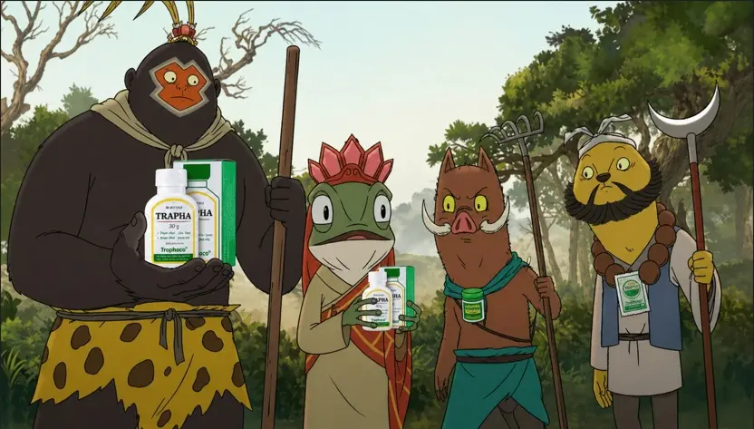
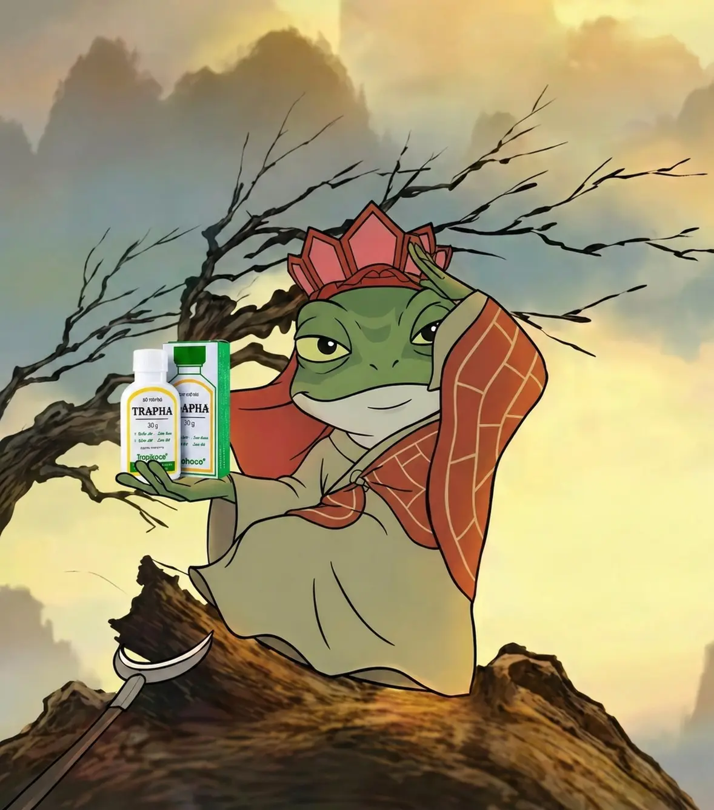
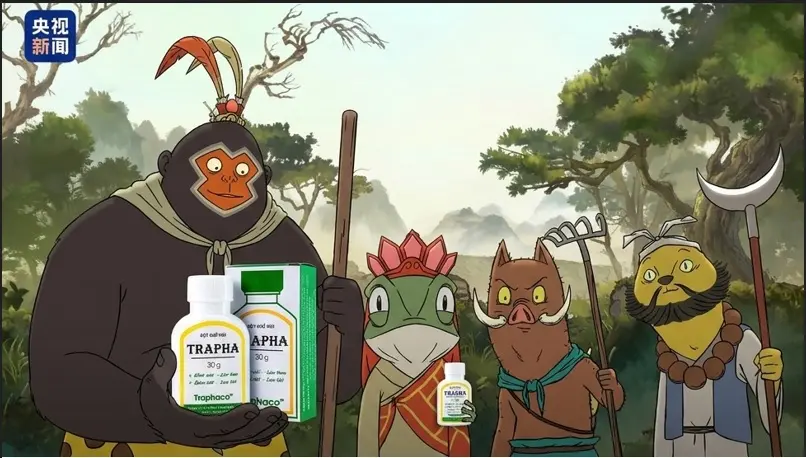

# SỰ THẬT VỀ TỈ LỆ TIÊU DIỆT YÊU QUÁI: BẰNG MÙI NÁCH CỦA TA

Ngày xửa ngày xưa, khi tiểu tăng còn lặn lội từ Đông Thổ Đại Đường xa xôi sang tận... Đông Lào để thỉnh kinh, người ta cứ bảo 81 kiếp nạn là thử thách lớn nhất. 

Nhưng thực tế, có một kiếp nạn thầm kín mà cuốn sổ của Nam Tào không hề ghi lại: **Mùi cơ thể dưới cái nắng Hỏa Diệm Sơn.** Các thí chủ đừng lầm tưởng gậy sắt là thứ làm yêu quái khiếp sợ nhất. Vạn dặm xa xôi, vượt đèo lội suối, vì mùi nách của ta thì yêu quái cũng ngất lịm trước khi kịp đòi ăn thịt.

Sự thật là, **80% yêu quái đã gục ngã vì 'hơi thở của nách'** sư phụ trước khi Ngộ Không kịp ra tay. Hôm nay, sau khi đã tu thành chính quả và có đủ sự tự tin để đứng gần bất kỳ mỹ nhân yêu quái nào, tiểu tăng xin hé lộ bí kíp giúp ta giữ được phong thái ung dung, khô thoáng suốt hành trình thỉnh kinh, học tập, thể thao đầy gian khổ.

  <a href="https://shorten.asia/F7yGRPsp" target="_blank" style="background: rgba(40, 167, 69, 0.9); color: white !important; padding: 15px 40px; border-radius: 8px; font-weight: 800; text-decoration: none !important; display: inline-block; transition: all 0.3s ease; border: 2px solid transparent; box-shadow: 0 4px 15px rgba(40, 167, 69, 0.3);">
    THỈNH BẢO VẬT TRAPHA TRÊN SHOPEE
  </a>

## LÝ DO TẠI SAO CƠ THỂ CỦA CHÚNG TA LẠI CÓ MÙI?

Thực ra thì cơ thể của chúng sinh đều cao quý, ai cũng có mùi cơ thể dù ít hay nhiều. Do hoạt động thể thao, ăn uống đồ cay nóng, vệ sinh chưa đúng cách, hay áp lực cuộc sống sì-trét... vân vân.

Chứ hoàn toàn không do nghiệp của chúng ta đâu. Đoạn này tiểu tăng phải thực hiện chiến dịch "đổ lỗi cho hoàn cảnh", để chúng sinh bớt mặc cảm về cái nách của mình!

## TẠI SAO TRAPHA LẠI CÓ SỨC MẠNH "DIỆT HÔI" THẦN KỲ ĐẾN THẾ?

Ta dùng rồi mới thấy, cái thứ bột này nó thực tế hơn trăm ngàn phép thuật màu mè:

1. **Khô thoáng tuyệt đối - "Thân tâm an lạc"**: Trapha hút ẩm siêu đỉnh, giúp nách lúc nào cũng khô ráo dù ta có phải leo núi hay chạy trốn yêu quái.
2. **Khử mùi tận gốc**: Khác với nước hoa của Ngộ Không chỉ đè mùi hôi, Trapha tiêu diệt vi khuẩn gây mùi.
3. **Thành phần thảo dược lành tính**: Không gây thâm nách, không gây ố vàng áo cà sa. Ta mặc áo trắng thỉnh kinh mà nách vẫn trắng tinh!

> **👉 Tạm biệt nỗi lo ố vàng áo sơ mi – Sắm ngay Trapha chính hãng trên Shopee**

  <a href="https://shorten.asia/F7yGRPsp" target="_blank" style="background: rgba(40, 167, 69, 0.9); color: white !important; padding: 15px 40px; border-radius: 8px; font-weight: 800; text-decoration: none !important; display: inline-block; transition: all 0.3s ease; border: 2px solid transparent; box-shadow: 0 4px 15px rgba(40, 167, 69, 0.3);">
    SẮM NGAY TRAPHA CHÍNH HÃNG
  </a>

## KHI "THỊT ĐƯỜNG TĂNG" TRỞ NÊN THƠM NỨC LÒNG NGƯỜI

Từ ngày có Trapha, ta tự tin hẳn. Thịt thơm như múi mít, không còn ngại ngùng mỗi khi yêu quái bắt đi tắm nữa. Thậm chí, bây giờ ta cứ nói toạc móng heo ra: *"Ừ, ta từng hôi đấy, thì sao nào? Giờ ta có Trapha rồi nè! Tự tin luôn tỏa sáng."*

Bọn yêu quái thấy ta không còn vung tay làm chúng chết ngạt nữa thì lại càng muốn bắt ta vì thơm quá. Haizz! Vậy là đằng nào cũng bị bắt làm thịt sao?

## HƯỚNG DẪN "THỈNH" TRAPHA ĐÚNG CÁCH

Các thí chủ lưu ý lời tiểu tăng dặn nhé:
* **Vệ sinh sạch sẽ:** Sau khi tắm xong, lau khô vùng da dưới cánh tay.
* **Táp bột đều tay:** Lấy một lượng nhỏ bột Trapha, xoa nhẹ nhàng vào nách.
* **Sử dụng hàng ngày:** Chỉ cần 1-2 lần mỗi ngày để tự tin từ Đông Thổ đến Tây Thiên.

  <a href="https://shorten.asia/F7yGRPsp" target="_blank" style="background: rgba(40, 167, 69, 0.9); color: white !important; padding: 15px 40px; border-radius: 8px; font-weight: 800; text-decoration: none !important; display: inline-block; transition: all 0.3s ease; border: 2px solid transparent; box-shadow: 0 4px 15px rgba(40, 167, 69, 0.3);">
    ĐẶT MUA TRAPHA GIÁ RẺ NHƯ CHO
  </a>

## HÓA RA THÀNH CÔNG LÀ KHÔNG CÓ MÙI

Thành công không xa xôi, mà nó nằm ngay trong bàn tay của chúng ta nhờ có Trapha. Bạn có thể có 72 phép biến hóa, nhưng nếu cơ thể bạn bốc mùi, người ta sẽ đứng cách xa bạn vạn dặm trước khi kịp nhận ra giá trị của bạn.

> **Thiện tai! Người xuất gia không ăn nói xà lơ.**

**"Đừng để mồ hôi cơ thể làm ảnh hưởng đến con đường thăng tiến của bạn. Trên đời này tại hạ thấy đơn giản nhất của thành công chính là... không có mùi!"**

  <a href="https://shorten.asia/F7yGRPsp" target="_blank" style="background: rgba(40, 167, 69, 0.9); color: white !important; padding: 15px 40px; border-radius: 8px; font-weight: 800; text-decoration: none !important; display: inline-block; transition: all 0.3s ease; border: 2px solid transparent; box-shadow: 0 4px 15px rgba(40, 167, 69, 0.3);">
    MUA TRAPHA TRÊN SHOPEE NGAY!
  </a>

A Di Đà Phật... Chúc các vị thí chủ luôn thơm tho, sạch sẽ và sớm đắc đạo thành công! 🙏❤️

---
**#Trapha #Traphaco #KhuMuiCoThe #TriHoiNach #BotKhuMui**