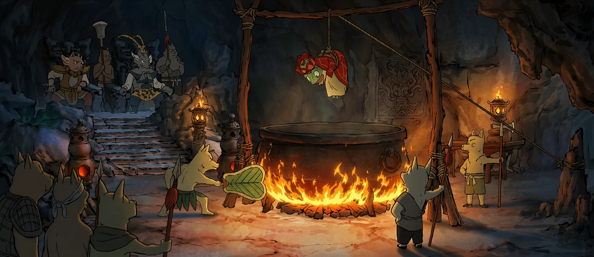

# SỰ THẬT VỀ TỈ LỆ TIÊU DIỆT YÊU QUÁI: BẰNG MÙI NÁCH CỦA TA

Chào mừng các thí chủ đến với ĐườngTăng.vn! Tiểu tăng và nhóm huynh đệ đây vốn là bốn tiểu yêu tinh đến từ núi Lãng Lãng

hiện đang trong dự án "khởi nghiệp" hóa thân thành thầy trò Đường Tăng để đi thỉnh kinh tại... Đông Lào.

Người đời cứ bảo 81 kiếp nạn là thử thách lớn nhất, nhưng thực tế, chúng ta đang đối mặt với một kiếp nạn thầm kín mà cuốn sổ của Nam Tào không hề ghi lại: Mùi cơ thể dưới cái nắng Hỏa Diệm Sơn.

- Đừng lầm tưởng gậy sắt là thứ làm yêu quái khác khiếp sợ nhất. Trên vạn dặm xa xôi, vượt đèo lội suối này, sự thật là:

- 80% yêu quái đang gục ngã vì "hơi thở của nách" sư phụ trước khi "Ngộ Không phẩy" kịp ra tay.

Kẻ thù không phải yêu ma, mà là mồ hôi và sự bí bách.

Hôm nay, tiểu tăng sẽ riview Thần dược trapha trị mùi hôi cơ thể. Để bạn đủ sự tự tin để đứng gần bất kỳ mỹ nhân xinh đẹp nào

tiểu tăng xin hé lộ bí kíp giúp ta giữ được phong thái ung dung, khô thoáng suốt hành trình thỉnh kinh, học tập, thể thao đầy gian khổ.

  <a href="https://shorten.asia/F7yGRPsp" target="_blank" style="background: rgba(40, 167, 69, 0.9); color: white !important; padding: 15px 40px; border-radius: 8px; font-weight: 800; text-decoration: none !important; display: inline-block; transition: all 0.3s ease; border: 2px solid transparent; box-shadow: 0 4px 15px rgba(40, 167, 69, 0.3);">
    THỈNH BẢO VẬT TRAPHA TRÊN SHOPEE
  </a>

## VẠN DẶM THỈNH KINH: KHI "MÙI CƠ THỂ" LÀM RÀO CẢN ĐẠO QUẢ

Người ta cứ hay hỏi, tại sao mỗi lần yêu quái bắt được ta, việc đầu tiên chúng làm không phải là bắc nồi nước sôi, mà là khiêng ta đi tắm?

hơ hơ... Ban đầu ta cứ tưởng chúng hiếu khách, sạch sẽ. Nhưng sự thật nó cay đắng hơn nhiều!

Thú thật với các thí chủ là, ta... ta hôi lắm!

Ta biết chứ, nhưng lòng tự trọng của một vị cao tăng giả mạo, không cho phép ta thừa nhận.

Thế nhưng mấy con yêu quái cái mồm nó không có chút tốt đẹp nào cả.

Chúng nó cứ bưng mũi mà la lên: 

> *"Ôi giồi ôi, thịt Đường Tăng thì trường sinh bất lão thật đấy, nhưng cái mùi "cóc chết" này thì nuốt sao trôi!"*

## SỰ THẬT VỀ TỈ LỆ TIÊU DIỆT YÊU QUÁI: CÂY GẬY HAY CÁI NÁCH?

Nhiều người cứ tưởng Ngộ Không là người gánh team.

Nhưng thực tế phũ phàng lắm: Trên đường đi thỉnh kinh, thực ra chỉ có **20%** yêu quái bị tiêu diệt là do cái thằng đại đồ đệ của ta vung gậy sắt.

 Đó thường là những con yêu quái "phèn phèn", cấp thấp, trình độ non kém nên mới để Ngộ Không áp sát.

Còn những con yêu quái thuộc dạng "le-vờ cao", pháp lực thâm hậu hơn, thì đến **80%** là do ta vung cánh tay lên một phát là yêu quái chết ngạt luôn! 

Ác hiểm ở chỗ đó. Ta chỉ cần giả vờ vươn vai định niệm chú thôi, là mùi hương "vạn năm tích tụ" từ vùng nách ta tỏa ra khiến đối phương trúng độc, sùi bọt mép mà quy tiên ngay tại chỗ. 

Ta đau khổ lắm, ngại ngùng lắm, tự ti xấu hổ lăm, vì ta vốn là người từ bi, không muốn sát sinh bằng "vũ khí sinh học" thế này chút nào!

## SỰ BẤT LỰC CỦA 72 PHÉP KHỬ MÙI VÀ "CHÂN KINH" TRAPHA

Ta đau khổ quá, có lần gọi ba đứa đồ đệ lại bảo: *"Thôi, giải tán đi. Ta hôi nách thế này, đi đến Tây Thiên chắc Phật Tổ cũng đuổi về mất thôi."* 

Đến nỗi Ngộ Không dùng 72 phép biến hóa, xịt lên người ta 7749 loại nước hoa thượng hạng nhưng đều thất bại.

ta nói thật Mùi nước hoa trộn mùi "viêm cánh" nó tạo ra một thứ hỗn hợp còn kinh khủng hơn cả bãi rác ở sông tô lịch ở cái sứ Đông Lào

tội lỗi!.. tội lỗi!....

Cuối cùng, Ngộ Không phải lên tận trời cầu cứu Quan Thế Âm Bồ Tát.

Bồ Tát mỉm cười, lấy ra một lọ bột trắng tinh khiết bảo: cái này bán đầy ở shopee dưới hạ giới nước Đông Lào online đầy

  <a href="https://shorten.asia/F7yGRPsp" target="_blank" rel="nofollow" 
     style="background-color: #28a745; color: white !important; padding: 16px 32px; font-size: 18px; font-weight: bold; text-transform: uppercase; border-radius: 50px; text-decoration: none !important; display: inline-block; box-shadow: 0 10px 20px rgba(40, 167, 69, 0.3); border: 2px solid #1e7e34; cursor: pointer;">
    ✨ MUA NGAY TRAPHA CHÍNH HÃNG ✨
  </a>

## LÝ DO TẠI SAO CƠ THỂ CỦA CHÚNG TA LẠI CÓ MÙI?

Thực ra thì cơ thể của chúng sinh đều cao quý, ai cũng có mùi cơ thể dù ít hay nhiều. Do hoạt động thể thao, ăn uống đồ cay nóng, vệ sinh chưa đúng cách, hay áp lực cuộc sống sì-trét... vân vân.

Chứ hoàn toàn không do nghiệp của chúng ta đâu. Đoạn này tiểu tăng phải thực hiện chiến dịch "đổ lỗi cho hoàn cảnh, đổ lỗi cho một thực thể siêu nhiên nào đó", để chúng sinh bớt mặc cảm về cái nách của mình!

## TẠI SAO TRAPHA LẠI CÓ SỨC MẠNH "DIỆT HÔI" THẦN KỲ ĐẾN THẾ?

Ta dùng rồi mới thấy, cái thứ bột này nó thực tế hơn trăm ngàn phép thuật màu mè:

- **Khô thoáng tuyệt đối - "Thân tâm an lạc"**: Trapha hút ẩm siêu đỉnh, giúp nách lúc nào cũng khô ráo dù ta có phải leo núi hay chạy trốn yêu quái.
- **Khử mùi tận gốc**: Khác với nước hoa của Ngộ Không chỉ đè mùi hôi, Trapha tiêu diệt vi khuẩn gây mùi.
- **Thành phần thảo dược lành tính**: Không gây thâm nách, không gây ố vàng áo cà sa. Ta mặc áo trắng thỉnh kinh mà nách vẫn trắng tinh!

> **👉 Tạm biệt nỗi lo ố vàng áo sơ mi – Sắm ngay Trapha chính hãng trên Shopee**

  <a href="https://shorten.asia/F7yGRPsp" target="_blank" style="background: rgba(40, 167, 69, 0.9); color: white !important; padding: 15px 40px; border-radius: 8px; font-weight: 800; text-decoration: none !important; display: inline-block; transition: all 0.3s ease; border: 2px solid transparent; box-shadow: 0 4px 15px rgba(40, 167, 69, 0.3);">
    SẮM NGAY TRAPHA CHÍNH HÃNG
  </a>

## KHI "THỊT ĐƯỜNG TĂNG" TRỞ NÊN THƠM NỨC LÒNG NGƯỜI

Từ ngày có Trapha, ta tự tin hẳn. không còn mùi cóc chết nữa, Thịt thơm như múi mít, không còn ngại ngùng mỗi khi yêu quái bắt đi tắm nữa.

Thậm chí, bây giờ ta cứ nói toạc móng heo ra: *"Ừ, ta từng hôi đấy, thì sao nào? Giờ ta có Trapha rồi nè! Tự tin luôn tỏa sáng."*

Bọn yêu quái thấy ta không còn vung tay làm chúng chết ngạt nữa thì lại càng muốn bắt ta vì thơm quá.

Cái thằng Bát giới mồ hôi dầu, nên là nó cũng lấy xoa xoa vào dưới cánh tay bảo: " phen này hằng nga say như điếu đổ..."

ta thương nhất cái thằng đệ út Sa tăng: từ ngày có trapha nên không còn hôi chân nữa

còn cái thằng Ngộ không thì suốt ngày sợ yêu quái cướp mất bảo vật trapha đấy

Suốt trặng đường từ tây thiên sang đông lào thỉnh kinh, bao nhiêu là em yêu quái xinh đẹp bồ kết ta từ đó

Haizz! cái số ta nó thế. đằng nào cũng bị bắt làm thịt!

## HƯỚNG DẪN "THỈNH" TRAPHA ĐÚNG CÁCH

Các thí chủ lưu ý lời tiểu tăng dặn nhé:

* **Vệ sinh sạch sẽ:** Sau khi tắm xong, lau khô vùng da dưới cánh tay.
* **Táp bột đều tay:** Lấy một lượng nhỏ bột Trapha, xoa nhẹ nhàng vào nách.
* **Sử dụng hàng ngày:** Chỉ cần 1-2 lần mỗi ngày để tự tin từ Đông Thổ đến Tây Thiên.
* Giá bán lẻ trên shopee: chỉ có vài chục nghìn đồng luôn á!
* thí chủ có thể mua tặng cho bạn bè, hoặc người thương thì đúng thật là một món quà ý nghĩa

  <a href="https://shorten.asia/F7yGRPsp" target="_blank" style="background: rgba(40, 167, 69, 0.9); color: white !important; padding: 15px 40px; border-radius: 8px; font-weight: 800; text-decoration: none !important; display: inline-block; transition: all 0.3s ease; border: 2px solid transparent; box-shadow: 0 4px 15px rgba(40, 167, 69, 0.3);">
    ĐẶT MUA TRAPHA GIÁ RẺ NHƯ CHO
  </a>

## HÓA RA THÀNH CÔNG LÀ KHÔNG CÓ MÙI

Thành công không xa xôi, mà nó nằm ngay trong bàn tay của chúng ta nhờ có Trapha. Bạn có thể có 72 phép biến hóa, nhưng nếu cơ thể bạn bốc mùi, người ta sẽ đứng cách xa bạn vạn dặm trước khi kịp nhận ra giá trị của bạn.

> **Thiện tai! Người xuất gia không ăn nói xà lơ.**

**"Đừng để mồ hôi cơ thể làm ảnh hưởng đến con đường thăng tiến của bạn.

Trên đời này tại hạ thấy đơn giản nhất của thành công chính là... không có mùi!"**

  <a href="https://shorten.asia/F7yGRPsp" target="_blank" style="background: rgba(40, 167, 69, 0.9); color: white !important; padding: 15px 40px; border-radius: 8px; font-weight: 800; text-decoration: none !important; display: inline-block; transition: all 0.3s ease; border: 2px solid transparent; box-shadow: 0 4px 15px rgba(40, 167, 69, 0.3);">
    MUA TRAPHA TRÊN SHOPEE NGAY!
  </a>

**A Di Đà Phật... Chúc các vị thí chủ luôn thơm tho, sạch sẽ và sớm đắc đạo thành công!** 🙏❤️

---

**#Trapha #Traphaco #KhuMuiCoThe #TriHoiNach #BotKhuMui**
