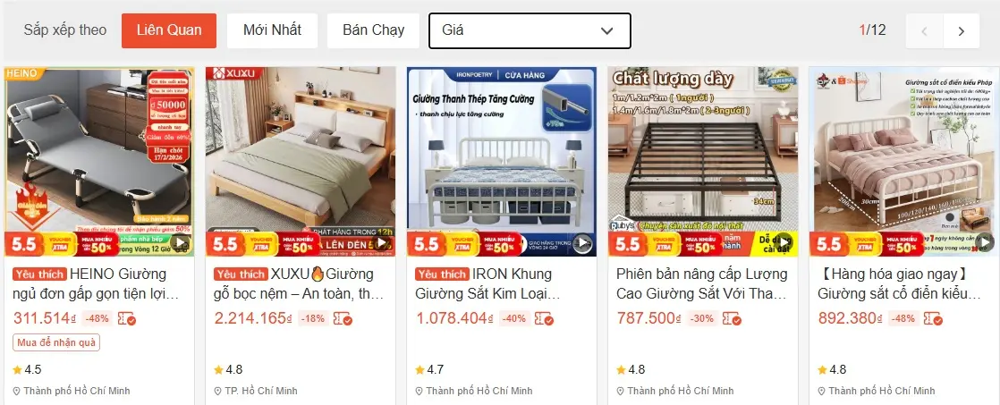

## SA TĂNG REVIEW - KHI GIƯỜNG NGỦ LÀ NƠI GÁC LẠI BỤI TRẦN VÀ NỖI ĐAU THẾ THÁI

Chào các thí chủ đã đến với góc nhỏ review đồ Shopee của Sa Tăng nhé!

Bước chân vào đây rồi thì cứ tự nhiên như ở nhà, đừng khách khí.

Ta xin tự giới thiệu, ta vốn là một trong bốn tiểu yêu dưới chân núi Lãng Lãng.

Cái ngày định mệnh ấy, chẳng hiểu ma xui quỷ khiến thế nào mà cả bọn lại đồng ý đóng giả bốn thầy trò Đường Tăng để lên đường thỉnh kinh.

Sư phụ Cóc phân vai cho ta làm Sa Tăng – cái gã mà các thí chủ vẫn thấy trong phim tây du ký, gã ấy mặt mũi bặm trợn, râu ria xồm xoàm

tóm lại là một tay ù lỳ nhưng tốt tính, chỉ biết gánh hành lý suốt vạn dặm trường.

Nói thật, nhập vai này khổ lắm các thí chủ ạ.

Ta vốn nhiều lời nhưng nếu có lỡ kêu than thì họ bảo ta phải nhập vai nói ít mới giống Sa Tăng.

Theo kịch bản, sa tăng là kẻ từng làm vỡ chén ngọc trên Thiên Đình, bị đày xuống sông Lưu Sa.

Suốt mấy trăm năm ở dưới đáy sông ấy, chỉ biết nằm phơi lưng trên đá cuội sắc lẹm,  hơi lạnh thấu tận xương tủy

Hắn quên mất cảm giác thế nào là một chiếc giường đúng nghĩa.

Đến khi cả đoàn bày mưu đi thỉnh kinh, cái kiếp "Sa Tăng giả" này cũng chẳng khá khẩm hơn. 

Đêm thì trú trong hang đá ẩm thấp, ngày lại tựa gốc cây già, cái cột sống của một con tiểu yêu như ta chưa một ngày được thảnh thơi thực sự.

Thế nên, khi đoàn người chúng ta lạc bước đến nước Đông Lào, nhìn thấy những chiếc Giường bán trên Shopee, ta bỗng thấy sống mũi mình cay cay.

Hóa ra, hạnh phúc của đời người đôi khi chỉ cách mặt đất có vài gang tay.

  <a href="https://shorten.asia/caYSvJU9" target="_blank" rel="nofollow" 
     style="background-color: #28a745; color: white !important; padding: 16px 32px; font-size: 18px; font-weight: bold; text-transform: uppercase; border-radius: 50px; text-decoration: none !important; display: inline-block; box-shadow: 0 10px 20px rgba(40, 167, 69, 0.3); border: 2px solid #1e7e34; cursor: pointer;">
    ✨ MUA NGAY GIƯỜNG NGỦ✨
  </a>

## THỈNH BẢO VẬT GIƯỜNG NGỦ TẠI ĐÂY NHÉ

Ta thích trồng cây xanh, thích review không gian sống, nhà cửa và sân vườn, và vài  món đồ decor chill chill nào đó

Ở Đông Lào người ta hay bảo nhau "khách hàng là Thượng đế".

Mà đã là Thượng đế thì phải được hưởng những gì tinh túy nhất.

Ta dám khẳng định, ở hạ giới mà có cái giường chắc chắn, êm ái thế này thì Ngọc Hoàng có nhìn xuống cũng phải ghen tị đỏ mắt. 

Hóa ra Vua chúa ngày xưa cũng chỉ sướng đến thế là cùng, chứ làm sao có được cái cảm giác lưng được nâng đỡ, cột sống được vỗ về như các thí chủ bây giờ.

  <a href="https://shorten.asia/caYSvJU9" target="_blank" rel="nofollow" 
     style="background-color: #28a745; color: white !important; padding: 16px 32px; font-size: 18px; font-weight: bold; text-transform: uppercase; border-radius: 50px; text-decoration: none !important; display: inline-block; box-shadow: 0 10px 20px rgba(40, 167, 69, 0.3); border: 2px solid #1e7e34; cursor: pointer;">
    ✨ THỈNH NGAY KẺO LỠ✨
  </a>

À mà bây giờ, ta cũng chẳng biết Ngọc Hoàng trên Thiên Đình liệu có cái giường nào ra hồn như ở hạ giới hay không nữa.

Ngày xưa ta gác cửa cung điện, thấy giường của Ngài chạm trổ rồng phượng, dát vàng chói mắt, nhưng nằm lên chắc gì đã êm bằng gỗ thật, đệm sâu.

**Chất liệu gỗ thật, giá trị thật**
Chiếc giường gỗ tràm mà ta đang review đây, nó mộc mạc y như cái tính cách của ta vậy.

Gỗ tràm tự nhiên đã qua xử lý, cứng cáp và chịu lực cực tốt. Ta vác hành lý nặng hàng trăm cân còn chịu được, huống chi là một thân xác phàm trần của các thí chủ.

* **Không rung lắc, không tiếng kêu:** Với giường gỗ tràm chính hãng trên Shopee, các thí chủ sẽ có một giấc ngủ tĩnh lặng tuyệt đối, không có tiếng "cót két" làm phiền cơn mộng mị.
* **Mùi gỗ thơm nhẹ:** Nó thoang thoảng mùi rừng núi, giúp tâm hồn ta nhẹ nhàng như đang ngồi thiền dưới gốc cây bồ đề.

## GIƯỜNG NGỦ ĐỆM CAO SU - CÁI ÔM DỊU DÀNG SAU NHỮNG BÃO GIÔNG

Sư phụ có hay nói về lòng từ bi. Với ta, lòng từ bi của một căn phòng ngủ chính là chiếc Đệm Cao Su Non.

Các thí chủ ạ, cái lưng ta vác kinh sách vạn dặm, đi qua bao nhiêu núi cao đèo sâu, chỉ mong một chiếc đệm êm thế này để an giấc.

Người đời cứ mải mê đi tìm những thứ "mạ vàng", nhưng ta thấy, khi cơ thể mệt mỏi, vàng bạc cũng chẳng bằng một tấm đệm tốt.

**Nâng đỡ từng đốt sống tổn thương**
Cái đệm này nó ôm lấy từng đường cong của cơ thể, giống như cách Bồ Tát bao dung cho những lỗi lầm của chúng sinh vậy.

* **Thông thoáng khí:** Giúp lưng các thí chủ không bị hầm bí, mát mẻ như gió thổi trên sông Lưu Sa.
* **Kháng khuẩn, sạch sẽ:** Ta là người sợ nhất sự dơ bẩn. Chiếc đệm này giúp ngăn chặn bụi bẩn, bảo vệ sức khỏe cho cả gia đình.

👉 **[Yêu thương bản thân từ giấc ngủ – Click mua đệm cao su êm ái trên Shopee!]**

## GÓC CHILL CỦA SA TĂNG: VÕNG XẾP ĐƯA DUYÊN VÀ ĐÈN NGỦ HUYỀN ẢO

Ngoài giường êm đệm ấm, ta còn phát hiện ra một kho các thứ hay ho trên shopee nữa

nghỉ trưa mà có cái võng nữa thì nhất, cái cảm giác được đung đưa giữa trưa hè, nó giống như đang cưỡi trên một đám mây ngũ sắc bay về núi Lãng Lãng

  <a href="https://shorten.asia/sg4sVBxd" target="_blank" rel="nofollow" 
     style="background-color: #28a745; color: white !important; padding: 16px 32px; font-size: 18px; font-weight: bold; text-transform: uppercase; border-radius: 50px; text-decoration: none !important; display: inline-block; box-shadow: 0 10px 20px rgba(40, 167, 69, 0.3); border: 2px solid #1e7e34; cursor: pointer;">
    ✨ MUA VÕNG XẾP✨
  </a>

để thấy đời nhẹ tênh như lông hồng. Khung inox sáng loáng, chắc chắn, ta nằm lên mà không hề nghe một tiếng cọt kẹt dù thân hình ta cũng chẳng nhẹ nhàng gì.

Chưa hết, để biến căn phòng thành một chốn "thanh tẩy bụi trần" thực thụ, ta đã sắm thêm chiếc Đèn Ngủ Ánh Vàng tỏa ra thứ ánh sáng dịu nhẹ, xua tan đi bóng tối u ám của những hang động mà ta từng đi qua.

sau giờ làm mệt mỏi, giờ là lúc dành riêng cho bản thân mình!

Thêm vài món đồ decor bình dân như rèm cửa voan mỏng hay một chiếc gối ngủ,  kệ đầu giường bằng gỗ ép xinh xắn, căn phòng bỗng chốc trở nên ấm cúng lạ thường.

Ở hạ giới bây giờ thật sướng, chỉ cần vài đồng bạc lẻ là có thể sắm được cả một combo nội thất từ bộ chăn ga cotton đến gối tựa lưng êm ái

thí chủ hãy [click xem ngay những món decor bình dân này]

để tự thưởng cho bản thân sau những giờ làm việc mệt mỏi.

Ta cam đoan, chỉ cần đầu tư một chút tâm tư vào những món đồ nhỏ xinh này, giấc ngủ của các thí chủ sẽ ngọt ngào hơn cả đào tiên của Tây Vương Mẫu.

Đừng mải mê chạy theo những thứ xa hoa, đôi khi chỉ cần một góc nhỏ đủ sáng và một chiếc võng đủ đưa là đủ để thấy lòng an lạc vô biên

## TẠI SAO NGƯỜI ĐÓNG VAI ÍT NÓI NHƯ TA LẠI KHUYÊN CÁC THÍ CHỦ NÊN ĐẦU TƯ CHO PHÒNG NGỦ?

Có lẽ vì ta đã chứng kiến quá nhiều sự tan vỡ.

Một chiếc chén ngọc vỡ, ta mất cả tương lai.

Nhưng một giấc ngủ chưa thoải mái, các thí chủ sẽ mất đi sức khỏe để đối mặt với đời. 

Nhà là nơi để về, không phải nơi để tạm bợ.

Sa Tăng ta dù có đi khắp thiên hạ, lòng vẫn luôn hướng về một mái nhà bình yên. 

Một bộ chăn ga gối đệm sạch sẽ, thơm mùi nắng chính là "phép thuật" mạnh nhất để xua tan những ưu phiền ngoài kia.

Màu sắc trung tính giúp tâm trí không bị xao nhãng bởi những hào quang ảo vọng.

Và quan trọng nhất là giá cả bình dân: Chỉ cần hơn 2 triệu đồng là các thí chủ đã có một combo giường cực xịn trên Shopee rồi.

👉 **[Đừng chờ đến khi lưng đau mới hối hận – Thỉnh đồ dùng phòng ngủ Shopee ngay!]**

REVIEW THÊM NỘI THẤT PHÒNG NGỦ KHÁC NỮA:

võng sếp và giường ngủ bình dân.....

### LỜI TÂM SỰ CỦA NGƯỜI VÁC HÀNH LÝ

Nhiều khi ta tự hỏi, nếu ngày xưa ở Thiên Đình, ta có một chiếc giường êm ái để nghỉ ngơi sau những giờ canh gác mệt mỏi, liệu ta có sơ ý làm rơi chiếc chén ngọc ấy không? Có lẽ cái mệt mỏi đã khiến tay ta run, tâm ta loạn. 

Mặc dù chúng ta chỉ là những tiểu yêu tinh xuất thân từ núi Lãng Lãng, đóng giả thầy trò Đường Tăng sang Tây Thiên thỉnh kinh

nhưng ta nhận ra một điều: Cơm có thể ăn đạm bạc một chút, áo có thể mặc giản đơn một chút, nhưng cái giường nhất định phải vững chãi và êm ái.

- Bởi vì khi nhắm mắt lại, đó là lúc ta thực sự được là chính mình

- không còn là kẻ vác hành lý cho ai

- cũng không còn nỗi lo về những kiếp nạn sắp tới.

👉 **[Vì một giấc ngủ không còn kiếp nạn – Click ngay Shopee để nhận ưu đãi giường ngủ!]**

A Di Đà Phật... Bài review của ta đến đây là hết.

Ta lại phải vác hành lý đi tiếp đây.

Hy vọng các thí chủ sớm tìm được chiếc giường "chân kinh" của đời mình, khiến ngay cả Ngọc Hoàng cũng phải thèm thuồng nhé!

**Sa Tăng kính bút.**
